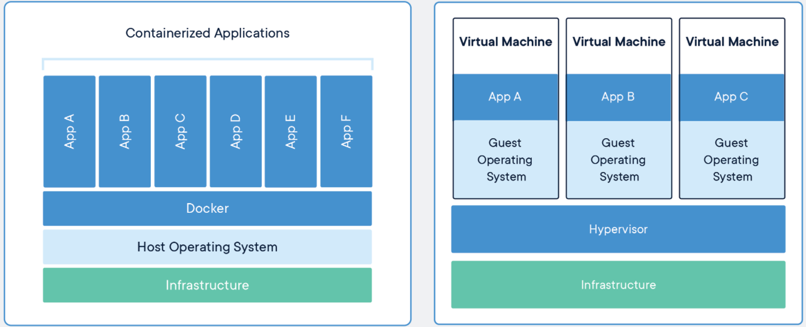

# Docker-KT

### Introduction:

Docker is a widely accepted and used tool by leading IT companies to build, manage and secure their applications.

Containers, like Docker, allow developers to isolate and run multiple applications on a single operating system, rather than dedicating a Virtual Machine for each application on the server. The use of these more lightweight containers leads to lower costs, better resource usage, and higher performance.

### Docker setup:
Note: This tutorial assumes that you have Docker installed in your machine. If not, you can follow the official Docker Install Guide.

- To install Docker Desktop [Docker Install Guide](https://docs.docker.com/get-docker/)

### Cointainer vs Virtual Machine:
 

### What is Docker?
Docker is a tool that enables developers to ship their applications (along with libraries and other dependencies), ensuring that they can run with the exact same configuration, regardless of the environment in which they're deployed.

This is done by isolating the applications in individual containers, which, although separated by containers, share the operating system and adequate libraries.

Docker can be broken down into:

- [Docker Engine](https://docs.docker.com/engine/) – A software packaging tool used to containerize applications.
- [Docker Hub](https://hub.docker.com/) – A tool for managing your container applications in the cloud.

### Why Containers?
It's important to understand the importance and usefulness of containers. Although they might not make much of a difference with a single application deployed to the server, or in home projects – containers can be a lifesaver when it comes to robust and resource-heavy applications, especially if they share the same server, or if they are deployed in many different environments.

This was firstly solved with Virtual Machines like VMWare and Hypervisors, though they've proven to not be optimal when it comes to efficiency, speed, and portability.

Docker Containers are lightweight alternatives to Virtual Machines – unlike VM's, we don't need to pre-allocate RAM, CPU, or other resources for them and we don't need to boot a new VM for each and every application since we're working with only one operating system.

Developers don't need to burden themselves with shipping special versions of software for different environments and can focus on creating the core business logic behind the app.

### Images

An image is a blueprint that contains the instructions to build a container. It's an immutable snapshot of the file system and configuration of an application. Images can be easily shared between developers.

### Containers
A container is a executable package that contains everything needed to run an application. It will always run the same, regardless of infrastructure, in a sandboxed environment. It is a running instance of an image.
 
### Docker basic commands References:
Refer these URLs for commands:
- [Docker Cheat sheet](https://dockerlabs.collabnix.com/docker/cheatsheet/)
- [List of Docker Commands: Cheat Sheet](https://phoenixnap.com/kb/list-of-docker-commands-cheat-sheet)

### Basic project setup  using Flask:
##### Reference 
- https://stackabuse.com/dockerizing-python-applications/

### Dockerfile
To use a container, you'll need to give instructions to Docker via a file called `Dockerfile` in the root of your project.

- **FROM** - Start the Dockerfile and pull from a base image
- **COPY** - Copy files from local source to container target
- **WORKDIR** - Set working directory for subsequent commands
- **RUN** - Run commands
- **EXPOSE** - Set a port
- **ENTRYPOINT** - Set executable command

